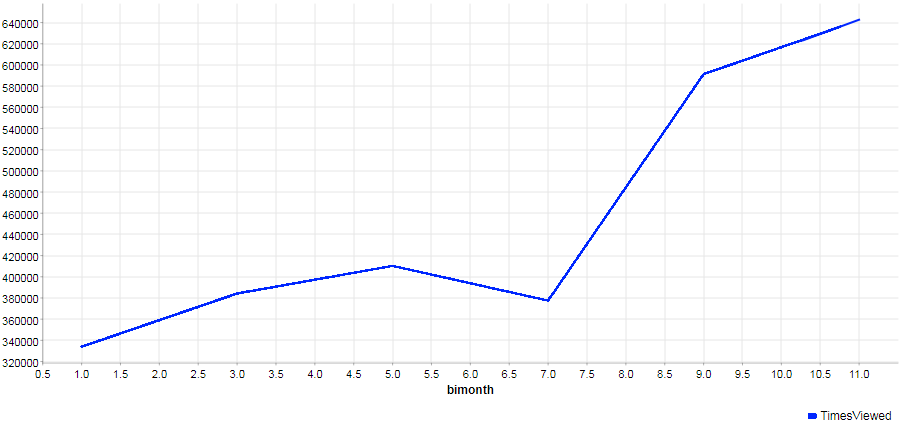
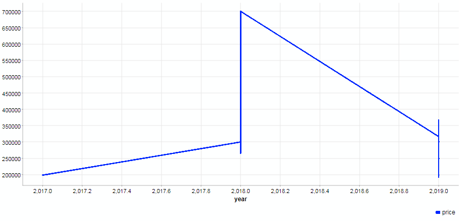
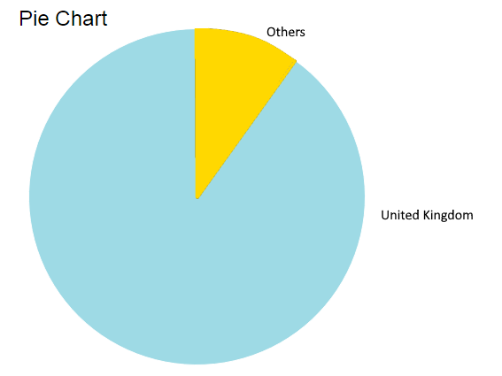

# Solution for *AI in Production* (coursera.org)

## 1. Running the application
To start this application run the following command:
```
python app.py
```
and navigate to the following url: [http://localhost:5000](http://localhost:5000)

**NOTE:** it might take a minute to respond the first time

## 2. Running tests
**NOTE:** Before running the unit tests, make sure the previous command is running

To run all the tests (summary style):
```
python run-tests.py
```
To run all the test (verbose style):
```
python run-tests.py -v
```
To run only the api tests
```
python unittests/ApiTests.py
```
To run only the model tests
```
python unittests/ModelTests.py
```

## 3. (Re)Training the model
A script is available to automate the ingestion of observations (and re-train all models):
```
python solution_guidance/model.py
```
it takes [Random Forest Regression](https://scikit-learn.org/stable/modules/generated/sklearn.ensemble.RandomForestRegressor.html) by default, however [Extra Trees Regression](https://scikit-learn.org/stable/modules/generated/sklearn.ensemble.ExtraTreesRegressor.html) is also available as an option when adding the following argument:
```
python solution_guidance/model.py extratrees
```

## 4. Visualizations

As part of the EDA investigation, these graphs were created:





## 5. References
Course link: [learn/ibm-ai-workflow-ai-production](https://www.coursera.org/learn/ibm-ai-workflow-ai-production)